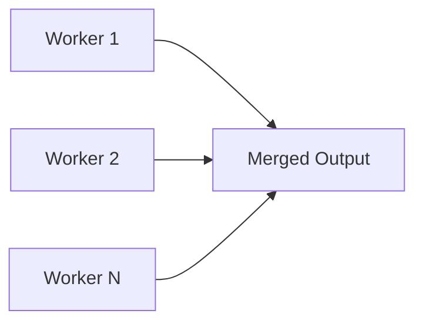
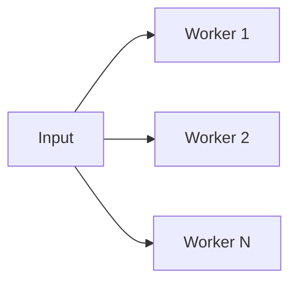

# Channels

## Communicating Sequential Process (CSP)
The concepts of goroutines and channels in Go are inspired by _Communicating Sequential Processes (CSP)_, a formal concurrency model developed by Tony Hoare. CSP describes systems as collections of independent processes that interact solely through message passing.

This maps directly to goroutines (independent processes) communicating via channels (message passing).

* **Concurrency**
	* Concurrency provides a way to structure programs so they can efficiently use multiple processor cores and handle many tasks at once.

### Goroutines
- A lightweight thread of execution managed by the Go runtime.
- You start one using the `go` keyword: `go funcName()`.
- Goroutines are cooperatively scheduled by the Go runtime, **not** by the operating system.

### Channels
* A synchronization primitive that allows goroutines to communicate and coordinate execution.
* **Example**
	```go
	// make a channel of type int
	ch := make(chan int)
	
	go func(){
		// send the value 1 into the channel
		ch <- 1
	}()
	
	// receive the value from the channel and print
	fmt.Println(<-ch)
	```

## Understanding Channels
* Channels provide **communication** between goroutines and behave like a **FIFO (First-In, First-Out) queue** in practice (although FIFO is not guaranteed by the spec).
* Channels are typed:
	```go
	make(chan T, capacity)
	```

	* The type `T` determines the type of data transmitted.
	* **`capacity`**
		* Defines the buffer size.
		* If omitted or zero, the channel is _unbuffered_, and communication only succeeds only when both sender and receiver are ready.
* They are passed by reference, meaning that when creating a channel and then passing it to other functions, these functions will have the same reference pointing to the same channel.
* Primary operations:
	* `ch <- v` — send `v` to channel `ch`.
	* `v := <-ch` — receive from `ch`, and assign value to `v`.
	* `<-ch` — receive value without assigning.
* **Send and receive operations are block by default**.
	* Sending blocks until a receiver is ready (unbuffered) or buffer has space (buffered).
	* Receiving blocks until a sender sends (unbuffered) or buffer has data.
* **Closing a channel**
	* `close(ch)` signals that no more values will be sent.
	* Sending on a closed channel will panic.
	* Receiving from a closed channel, always succeeds:
		* Returns remaining buffered values
		* Then returns the zero value of the element type indefinitely
* **Example**
	```go
	timerChan := make(chan time.Time)
	go func() {
	    time.Sleep(delta)

		// send time on timerChan
	    timerChan <- time.Now()
	}()
	
	// do something else; when ready, receive
	// receive will block until timerChan delivers
	// value sent is other goroutine's completion time
	completedAt := <-timerChan
	```

### Channel States
* **`nil` State**
	* **Syntax**: `var ch chan int`
	* Constructing a channel to its **zero value** state and is **never ready** for communication.
	* Sends and receives against channels in this state will be blocked.
	* Close (`close(ch)`) panics with a runtime error.
	* This is good for situations where you want to implement **short-term** stoppages of work.
* **Open State**
	* Created using the built-in function `make`.
	* Sends and receives against channels in this state will work under the following conditions:
		* **Unbuffered Channels**
			* No capacity.
			* Guarantees at the signaling level with the **receive happening before send**.
			* Sending and receiving goroutines need to come together in the same space and time for a signal to be processed.
			* Provide synchronization: communication is _synchronous_.
		* **Buffered Channels**
			* Have capacity.
			* Guarantees outside of the signaling level, with the send happening before the receive.
			* If the buffer is not full, sends can complete; else they block. If the buffer is not empty, receives can complete; else they block.
* **Closed State**
	* By using a built-in function `close`.
	* Closing a channel signals that no more values will be sent.
	* Sending on a closed channel will cause a panic.
	* Receiving on a closed channel, returns remaining buffered values, then zero values.

### Send Statement
* **Syntax**: `ch <- value`
* Sends a `value` on a channel `ch`.
* Rules:
	* _Unbuffered Channel_:  send blocks until a receiver is ready.
	* _Buffered Channel_: send blocks if buffer is full.
	* _Closed Channel_: send causes a runtime panic.
	* _`nil` Channel_: send blocks forever.

### Receive Operator
* **Syntax**: `value := <-ch`
* Receives a `value` from a channel `ch`.
* Rules:
	* _`nil` Channel_: blocks forever.
	* _Closed Channel_: returns buffered values, then zero values.
	* Direction of channel must allow receiving.

## Buffered and Unbuffered Channels
* **Unbuffered Channels**
	* **Syntax**: `ch := make(chan T)`
	* Have **_no capacity_** to hold any value before it's received.
	* Sends to an unbuffered channel block until the receiver has received the value, and vice versa.
	* **Key Features**
		* Synchronous
		* Sending and receiving operations block until the other side is ready
	* **Example**
		```go
		func main() {
			// create an unbuffered channel
			ch := make(chan int)
			
			go func(){
				fmt.Println("sending 1 to channel")
				ch <-1
				fmt.Println("after sending value")
			}()
			
			// sleep for 3 seconds to ensure the goroutine has time to send
			// the value
			time.Sleep(3*time.Second)
			
			fmt.Println("receiving value from channel")
			val := <-ch
			fmt.Println(val)
			
			// sleep 1 second to ensure goroutine has time to finish goroutine
			time.Sleep(1*time.Second)
		}	
		```
* **Buffered Channels**
	* **Syntax**: `make(chan T, capacity)`
		* Where:
			* `capacity`: an integer representing the size of the buffer.
	* Has a capacity and only ***blocks when the capacity is full***.
	* **Note**: It's important to note that messages are received in the same order they were sent (FIFO - First In, First Out).
	* **Key Feature**
		* Asynchronous
		* Sending and receiving operations only block when buffer is full or empty
	* **Example**
		```go
		func main() {
			// create a buffered channel with capacity 2
			ch := make(chan int, 2)
			
			// start timing to calculate the time elapsed
			start := time.Now()
			
			// sender goroutine sends data to the channel
			go sender(ch, start)
			
			// receiver goroutine receives data from the channel
			go receiver(ch, start)
			
			// delay for two goroutines to complete
			time.Sleep(6*time.Second)
		}
		
		func sender(ch chan<- int, start time.Time) {
			for i := 1; i <= 3; i++ {
				fmt.Printf("sending %d at %s\n", i, time.Since(start))
				ch <- i
				fmt.Printf("sent %d at %s\n", i, time.Since(start))
			}
		}
		
		func receiver(ch <-chan int, start time.Time) {
			// delay start to demonstrate buffer filling up
			time.Sleep(2 * time.Second)
			
			for i := 1; <= 3; i++ {
				val := <-ch
				fmt.Printf("recieved %d at %s\n", val, time.Since(start))
				
				// sleep to simulate slow receiver
				time.Sleep(1000*time.Millisecond)
			}
		}
		```

## Directional Channels
* If a direction is given, the channel is *directional*, otherwise it is bi-directional.
* It means that you can restrict a channel to ***only*** send or receive data.
* This is specified by the `<-` accompanied with the channel declaration.
* **Send-only channel**
	* **Syntax**: `chan<- T`
	* Can only be used to send `T`.
	* Cannot read from, but can write to and  `close()`.
* **Receive-only channel**
	* **Syntax**: `out <-chan T`
	* Can only be used to receive `T`.
	* Can read from, but cannot write to or `close()`.
* **Bi-directional Channel**
	* **Syntax**: `chan T`
	* Default state: send and receive values of type `T`.

## Close Channel
* **Syntax**: `close(ch)`
* **Purpose**: To notify receivers that no more data will be sent, allowing them to stop waiting for additional data.
* Attempting to send data on a closed channel will cause a panic.
* Reading from a closed channel immediately returns the zero value of the channel's type without blocking.
* In Go concurrency patterns, it's common to see the function have the following patterns:
	* Create a channel.
	* Start a goroutine to send data to the channel.
		* Inside the goroutine, close the channel after sending all data.
	* Return the channel as receive-only channel to the caller.
* Receivers can detect closure using:
	* `v, ok := <-ch`
	* `for v := range ch`

## Range over Channels
* **Syntax**: `for v := range ch {...}`
* Using `range` on a channel:
	* Receives values until the channel is closed.
	* Exits loop when no more values are available.
* **Unbuffered Channel Example**
	```go
	func main() {
		ch := make(chan int)
		
		// start a goroutine that sends values
		go func(){
			for i := 0; i <= 5; i++ {
				ch <- i // send iterator to channel
			}
			
			close(ch)
		}()
		
		// range over the channel to receive value and will automatically
		// exists when the channel is closed
		for v := range ch {
			fmt.Println(v)
		}
	}
	```
* **Buffered Channel Example**
	```go
	func main() {
		// create a buffered channel that can hold up to 5 integers
		ch := make(chan int, 5)
		
		// send three values into the channel
		ch <- 5
		ch <- 3
		ch <- 9
		
		// close the channel to indicate no more values will be sent
		close(ch)
		
		// receive values from the channel until it is empty and closed
		for element := range ch {
			fmt.Println(element)
		}
	}
	```

> [!NOTES]
> * Leaving a channel open after finishing all sends causes `range` to block forever.
> * Only the sending side should close a channel.

## Fan-in and Fan-out
```go
// worker performs the task on jobs received and sends results to the results channel.
func worker(id int, jobs <-chan int, results chan<- int) {
	// continuously receives jobs, processes them (doubling the job value), and sends the
	// results to the results channel.
	for job := range jobs {
		result := job * 2
		results <- result
	}
}

func main() {
	numJobs := 10
	numWorkers := 4

	// Create buffered channels for jobs and results. Buffered channels have a capacity
	// which prevents blocking in cases where the channel's counterpart (read or write) isn't ready.
	jobs := make(chan int, numJobs)
	results := make(chan int, numJobs)

	// Fan-out: Create worker goroutines
	for w := 1; w <= numWorkers; w++ {
		// Each invoking the worker function with the worker's ID and the jobs and results channels.
		go worker(w, jobs, results)
	}

	// Produce jobs by sending job numbers to the jobs channels.
	for j := 1; j <= numJobs; j++ {
		jobs <- j
	}
	
	// Close the jobs channel to signal no more jobs will be sent.
	close(jobs)

	// Fan-in: Collect results
	var wg sync.WaitGroup  // Created to wait for all jobs to be completed
	wg.Add(numJobs)        // Set WaitGroup counter to the number of jobs

	// Launch a goroutine to wait for all jobs to finish
	go func() {
		wg.Wait()      // Wait for all jobs to be done
		close(results) // Close the results channel after all jobs are processed
	}()

	// Process results
	for result := range results {
		fmt.Println("Result:", result)
		wg.Done() // Decrease the WaitGroup counter as each result is processed
	}
}
```

#### Fan-in


* Fan-in is a term used to describe the process of ***combining multiple results into one channel***.
* Achieved by multiplexing values from several input channels onto one output channel, which is closed only after all input channels have been closed.
* Can simplify how you collect and process data from multiple channels.
* **Advantages**
	* Simplicity: Centralizing results into a single channel can simplify further processing.
	* Efficiency: Managing a single channel can be more efficient than dealing with multiple channels concurrently.

#### Fan-out


* It refers to the practice of ***starting multiple goroutines*** to handle incoming tasks.
* The main idea is to distribute incoming tasks to multiple handlers (goroutines) to ensure each handler deals with a manageable number of tasks.
* It is used when multiple functions read from the same channel. The reading will stop only when the channel is closed.
* Allows for parallelization of CPU-intensive or I/O-bound tasks, improving efficiency by utilizing multiple cores or handling concurrent operations.
* **Advantages**
	* Scalability: By distributing tasks across multiple goroutines, you can efficiently utilize CPU resources and ensure no single goroutines becomes a bottleneck.
	* Flexibility: It's easier to scale up or down by adjusting the number of goroutines as per the workload.

## Best Practices
* Only senders should call `close()`.
* Use `done` channels for signaling completion between goroutines.
	* When you need bi-directional communication or complex coordination, consider using `done` channels.
	* **Example**
		```go
		func worker(jobs <-chan Job, done chan<- bool) {
			for job := range jobs {
				process(job)
			}
			
			done <-true
		}
		```
* For multiple workers, use `sync.WaitGroup` rather than closing channels for coordination.

## Design Guidelines
* Don't architect software with the idea of channels being a queue; ***focus on signaling and the semantics*** that simplify the orchestration required.
* **Language Mechanics**
	* **Use channels to orchestrate and coordinate goroutines**
		* Focus on the signaling semantics and not the sharing of data.
		* Signaling with data or without data.
		* Question their use for synchronizing access to shared state.
	* **Unbuffered Channels**
		* Receive happens before the Send.
		* **Benefit**: 100% guarantee that the signal being sent has been received.
		* **Cost**: Unknown latency on when the signal will be received.
	* **Buffered Channels**
		* Send happens before the Receive.
		* **Benefit**: Reduce blocking latency between signaling.
		* **Cost**: No guarantee that the signal being sent has been received.
			* The larger the buffer, the less the guarantee.
			* A buffer of 1 can give you one delayed send of guarantee.
	* **Closing Channels**
		* Close happens before the Receive (like Buffered).
		* Signaling without data.
		* Perfect for signaling cancellations and deadlines.
	* **`nil` Channels**
		* Send and Receive block.
		* Turn off signaling.
		* Perfect for rate limiting or short-term stoppages.
* **Design Guidelines**
	* If any given Send on a channel **CAN** cause the sending goroutine to block:
		* Be careful with Buffered channels larger than 1.
			* Buffers larger than 1 must have a reason or measurements.
		* Must know what happens when the sending goroutine blocks.
	* If any given Send on a channel **WON'T** cause the sending goroutine to block:
		* You have the exact number of buffers for each send (Fan Out pattern).
		* You have the buffer measured for max capacity (Drop pattern).
	* Less is more with buffers.
		* Don't think about performance when thinking about buffers.
		* Buffers can help to reduce blocking latency between signaling.
			* Reducing blocking latency towards zero does not necessarily mean better throughput.
			* If a buffer of one is giving you good enough throughput, then keep it.
			* Question buffers that are larger than one and measure for size.
			* Find the smallest buffer possible that provides good enough throughput.

## 🔖 Extras
* **Ardan Labs**
	* [Channel Design](https://github.com/ardanlabs/gotraining/blob/master/topics/go/#channel-design)
	* [The Behavior of Channels](https://www.ardanlabs.com/blog/2017/10/the-behavior-of-channels.html)
	* [Ardan Labs: Ultimate Go Tour - Channels](https://tour.ardanlabs.com/tour/eng/channels/1)
- **Medium**
	- [Comprehensive Guide to Concurrency in Go](https://bwoff.medium.com/the-comprehensive-guide-to-concurrency-in-golang-aaa99f8bccf6)
	- [Golang Fan-In Fan-Out Concurrency Pattern](https://kapoorrahul.medium.com/golang-fan-in-fan-out-concurrency-pattern-f5a29ff1f93b)
    - [Concurrency in Golang, Goroutines, and Channels](https://levelup.gitconnected.com/concurrency-in-golang-goroutines-and-channels-explained-55ddb5e1881)
    - [For Range Over Channels in Go and What It Does](https://medium.com/@AlexanderObregon/for-range-over-channels-in-go-and-what-it-does-f6847e10438c)
- [Channels in Go](https://go101.org/article/channel.html)
- [Go Spec - Channel Types](https://go.dev/ref/spec#Channel_types)
- [Directional Channels in Go](https://blog.gopheracademy.com/advent-2019/directional-channels/)
- [Go Channel Patterns - Fan Out](https://dev.to/b0r/go-orchestration-patterns-fan-out-3d8n)
- [An Introduction to Channels in Go](https://www.sohamkamani.com/golang/channels/)
- [Go Blog - Pipelines and Cancellation](https://go.dev/blog/pipelines)
- [A Straightforward Guide for Go Channel](https://dev.to/eyochen/a-straightforward-guide-for-go-channel-3ba2)
- [What is the fan-out/fan-in pattern in Golang?](https://www.educative.io/answers/what-is-the-fan-out-fan-in-pattern-in-golang)
- [Go Concurrency Patterns: Diving into Fan-in and Fan-out](https://www.codingexplorations.com/blog/go-concurrency-patterns-diving-into-fan-in-and-fan-out)
- **Video**
	- https://www.youtube.com/watch?v=qyM8Pi1KiiM
	- https://www.youtube.com/watch?v=x6vBvgKGvxU
	- https://www.youtube.com/watch?v=rlPbtzBmHp8