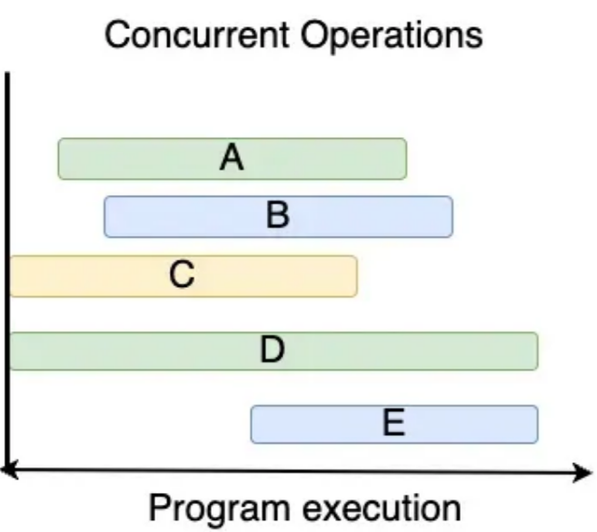
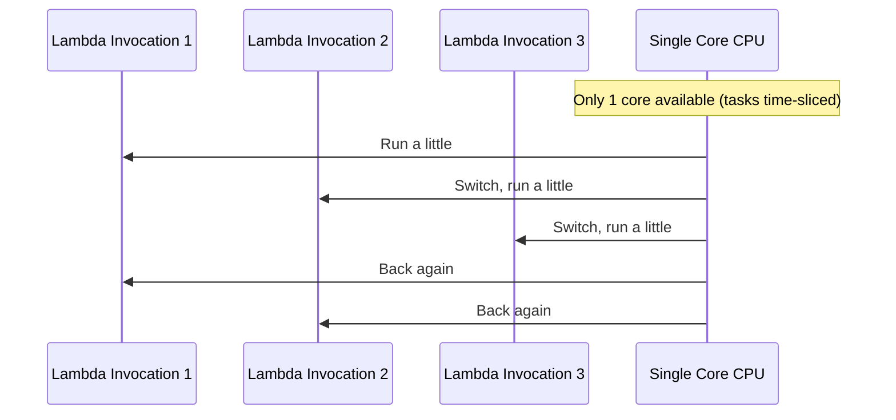
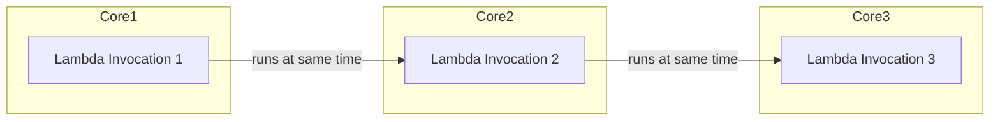
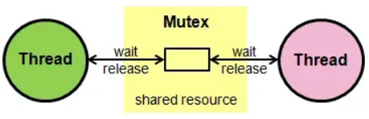

# Concurrency

- Go provides:
    - Concurrent executions (goroutines)
    - Synchronisation and messaging (channels)
    - Multi-way concurrent control (select)
- A way to structure a program by breaking it into pieces that **can be executed independently**.
- A program is considered concurrent if it **can handle multiple tasks simultaneously**. Each task can start at a different point in time. This means that a task does not have to wait until another task finishes before running.
- Have the ability to execute out-of-order or in partial order, without affecting the final outcome.
- **Diagram**
    
- **Concurrency vs Parallelism**
    - "Parallelism is about physically doing two or more things at the same time. Concurrency is about undefined, out-of-order, execution." — William Kennedy
    - **Concurrency**
        - About **structure** — structuring your program to handle many tasks at once.
        - It is the composition of **independently** executing tasks.
        - **Dealing with lots of things at once**.
            - It is about _**structuring your program**_ so it can make progress on multiple tasks, even if they share a single CPU core (by switching them).
        - Provides a way to structure a solution to solve a problem that may (but not necessarily) be parallelizable.
        - **Example**
            - A single chef cooking three dishes. She chops onions for dish A, stirs dish B, then checks the oven for dish C — she’s managing them together, even though her hands do one action at a time.
    - **Parallelism**
        - About **execution** — those tasks are physically running at the same instant.
        - The execution of tasks literally **happens at the same time**, like splitting the data processing task over multiple CPU cores.
        - **Actually doing lots of things at once**.
            - It needs multiple CPU cores (or CPUs), so two functions literally execute at the same time.
        - **Example**
            - Three chefs are cooking the three dishes simultaneously, one per chef.
        - In parallelism, **each core handles one task at a time**; multiple cores enable multiple tasks to run simultaneously.

### Visual Summary

|**CPU Cores**|**Tasks (Goroutines or Threads)**|**What Happens**|**Type**|
|---|---|---|---|
|1 Core|10 Tasks|Core switches between them quickly|**Concurrent only**|
|4 Cores|10 Tasks|4 tasks run **in parallel**, others wait their turn|**Concurrent + Parallel**|
|4 Cores|4 Tasks|All 4 tasks run **truly in parallel**|**Fully Parallel**|

### Analogy
**Concurrency in AWS Lambda (single-core behind the scenes)**



**Explanation:**
- You trigger 3 Lambdas at the same time.
- AWS accepts all 3 → they exist **concurrently**.
- But if only **1 core** is backing them, they just take turns (time-slicing).
- **Concurrency without parallelism**.

**Parallelism in AWS Lambda (multi-core scaling)**



**Explanation:**
- Same 3 Lambdas triggered.
- This time, AWS spreads them across **3 cores/containers**.
- Now all run **at the exact same instant**.
- **Concurrency + parallelism**.

## Design Philosophy
- The application **must** start up and shut down with integrity.
    - Know how and when every goroutine you create terminates.
    - Applications should be capable of shutting down on demand, even under load, in a controlled way.
- Identify and monitor critical points of [^1]back pressure that can exist inside your application.
    - Channels, mutexes, and atomic functions can create back pressure when goroutines are required to wait.
    - Back pressure that is imbalanced will cause:
        - Failures inside the software and across the entire platform.
        - Your application to collapse, implode, or freeze.
    - Measuring back pressure is a way to measure the health of the application.
- Rate limit to prevent overwhelming back pressure inside your application.
    - Applications should reject new requests as early as possible once they are overloaded.
        - Don’t take on more work than you can reasonably work on at a time.
        - Push back when you are at critical mass. Create your own external back pressure.
    - Use an external system for rate limiting when it is reasonable and practical.
- Use timeouts to release the back pressure inside your application.
    - Use the `context` package.
        - Functions that users wait for should take a `context`.
            - These functions should select on `<-ctx.Done()` when they would otherwise block indefinitely.
        - Set a timeout on a `context` only when you have a good reason to expect that a function’s execution has a real-time limit.
        - Allow the upstream caller to decide when the `context` should be cancelled.
        - Cancel a `context` whenever the user abandons or explicitly aborts a call.
- Architect applications to:
    - Identify problems when they are happening.
    - Stop the bleeding.
    - Return the system to a normal state.

## Goroutines
- It is like a process running in the background. A function with **`go`** keyword as a prefix starts the goroutine.
    ```go
    go f("hello", "world") // f starts running
    g()                    // does not wait for f to return
    ```
- It has a simple mode: it is a function executing concurrently with other goroutines in the same address space.
- A lightweight, efficient, and it does not cost too many resources to be created.
- The `main` function is a special goroutine invoked during the startup of any program by the Go runtime.
- "By default, goroutines shouldn't outlive the function they were created from. This forces you into an extremely good design posture." — Peter Bourgon
- **Example**
    ```go
    package main
    
    import (
    	"fmt"
    	"time"
    )
    
    var msg string
    
    func setMessage() {
    	msg = "Hello, World!"
    }
    
    func main() {
    	// It is invoked as a goroutine using the go keyword. If you run this
    	// program, you will get the 'Hello, World' message printed.
    	go setMessage()
    	
    	// If you change the sleep time to zero, the message will not be printed.
    	// This is because, the program exists when main function completes
    	// execution.
    	time.Sleep(1 * time.Millisecond)
    	fmt.Println(msg)
    }
    ```
- The Go scheduler is responsible for managing and executing goroutines.

### Shared Resources with Goroutines
- If multiple goroutines are accessing and modifying the same data at the same time, this will lead to several problems, unexpected results and what is called race conditions.

### Race Conditions
- It occurs when multiple operations running concurrently attempt to read or write the same data at the same time.
- A key component when implementing concurrency is ensuring that your program will not end up with unexpected results.

### Data Race
- It is a specific type of race condition defined more precisely: it occurs when two or more goroutines access the same memory location concurrently, and at least one of the accesses is a write, without proper synchronisation.
- The race detector can be enabled with the `-race` flag during `go run`, `go test`, or `go build` to identify data races.
- **Data Race vs Race Conditions**
    - **Data race is a low-level memory access conflict** that can be detected automatically by tools like Go’s built-in race detector, which identifies issues at runtime.
    - Race condition is a broader concept **related to program logic and timing**, and while race conditions involve data races, not all do—some may arise from an **improper sequence of operations** even when synchronisation is used.

### Scheduler Semantics
- **Work**
    - A set of instructions to be executed for a running application.
    - Accomplished by threads, and an application can have one-to-many threads.
- **Thread**
    - A path of execution that is scheduled and performed.
    - They are responsible for the execution of instructions on the hardware.
- **Thread States**
    - It can be in one of three states:
        - **Running**
            - The thread is executing its assigned instructions on the hardware by having a goroutine placed on the operating system thread.
        - **Runnable**
            - The thread wants time on the hardware to execute its assigned instructions and is sitting in a queue.
        - **Waiting**
            - The thread is waiting for something before it can resume its work. They are not a concern of the scheduler.
- **Concurrency**
    - Undefined out-of-order execution. In other words, given a set of instructions that would be executed in the order provided, they are executed in a different, undefined order, but all are executed.
    - **Key**: the result of executing the full set of instructions in any undefined order produces the same result.
- **Parallelism**
    - Doing a lot of things at once.
    - You need the ability to execute two or more operating system threads at the same time on the hardware.
- **CPU Bound Work**
    - It does not cause the thread to naturally move into a waiting state.
- **I/O Bound Work**
    - It does cause the thread to naturally move into a waiting state.
- **Synchronization**
    - When two or more Goroutines need access to the same memory location, potentially at the same time, they need to be synchronised and take turns.
- **Orchestration**
    - When two or more Goroutines need to signal each other, with or without data, orchestration is the mechanism required.

### `WaitGroup`
- It is actually a type of counter that blocks the execution of a function (or, might say, a goroutine) until its internal counter becomes 0.
- `WaitGroup` is concurrency safe, so it's safe to pass a pointer to it as an argument for Goroutines.
- **Methods**
    - `Add()`
        - Add the number of goroutines to wait for.
        - It increases `WaitGroup` counter by the given integer value.
    - `Wait()`
        - It blocks further operations until all goroutines are completed.
    - `Done()`
        - It decreases `WaitGroup` counter by 1.
        - Indicates that the task has been completed.
- **Example**
    ```go
    var msg string
    var wg sync.WaitGroup
    
    func setMessage() {
    	msg = "Hello, world"
    	wg.Done()
    }
    
    func main() {
    	// It make one item to wait for.
    	wg.Add(1)
    	
    	// Invoke the goroutine.
    	go setMessage()
    	
    	// Blocks any further operations until goroutines are
    	// completed.
    	wg.Wait()
    	
    	fmt.Println(msg)
    }
    ```

### `Context`
- It carries a deadline, cancellation signal, and request-scoped values across API boundaries.
- Does not have a `Cancel` method for the same reason, the `Done` channel is receive-only: the function receiving a cancellation signal is usually not the one that sends the signal.
- It is safe for simultaneous use by multiple goroutines.
- **Methods**
    - `Done()`
        - It returns a channel that is closed when this Context is cancelled or times out.
        - When the channel is closed, the functions should abandon their work and return.
    - `Err()`
        - It indicates why the context was cancelled, after the `Done()` channel is closed.
    - `Deadline()`
        - It returns the time when this `Context` will be cancelled, if any.
        - Allows functions to determine whether they should start work at all. If too little time is left, it may not be worthwhile.
    - `Value`
        - It returns the value associated with the key or `nil` if none.
        - Allows a `Context` to carry request-scoped data
- Do not store `Context` inside a struct type; instead, pass a `Context` explicitly to each function that needs it. The `Context` should be the first parameter, typically named `ctx`.
    ```go
    func DoSomething(ctx  context.Context, arg Arg) error {
    	// ... use ctx ...
    }
    ```
    - When you store the context in a struct, you obscure the lifetime to the callers, or worse, intermingle two scopes together in unpredictable ways.
    - When designing an API with context, remember the advice: pass `context.Context` in as an argument, don’t store it in structs.
- Do not pass a `nil` `Context`, even if a function permits it. Pass a `context.TODO()` if you are unsure about which context to use.
- Use context `Value` only for request-scoped data that transits processes and APIs, not for passing optional parameters to functions.
- The `context.Background()` returns an empty `Context`. It is never cancelled, has no deadline, and has no value. Typically used in `main`, `init`, and tests, and as a top-level `Context` for incoming requests.

## `Mutex` (Mutual Exclusion)

- Used to protect shared resources from simultaneous access by multiple goroutines.
- It **prevents race conditions** by allowing only one goroutine to acquire the lock and access the shared resource, while other goroutines wait until the lock is released.
- Utilises low-level atomic operations provided by the underlying processor architecture.
    - The use of atomic operations ensures that the lock’s state is updated atomically, without interference from other goroutines.
- **Example**
    ```go
    var counter = 0
    var mutex sync.Mutex
    
    func increment(wg *sync.WaitGroup) {
    	mutex.Lock()
    	counter++
    	mutex.Unlock()
    	wg.Done()
    }
    
    func main() {
    	var wg sync.WaitGroup
    	expectedCounter := 1000
    
    	for i := 0; i < expectedCounter; i++ {
    		wg.Add(1)
    		go increment(&wg)
    	}
    	wg.Wait()
    	
    	fmt.Println("Expected Counter:", expectedCounter)
    	fmt.Println("Actual Counter:", counter)
    
    	// Check for race condition
    	if expectedCounter != counter {
    		fmt.Println("Race condition detected!")
    		
    	} else {
    		fmt.Println("No race condition detected.")
    	}
    }
    ```
- Whenever you call the **`Lock`** method, you must ensure that **`Unlock`** is eventually called; otherwise, any goroutine trying to acquire the same lock will be blocked forever.
    - By deferring the **`Unlock`** method immediately after acquiring the lock, we ensure that the mutex will always be released, even if an error occurs or a panic is triggered.
- **`RWMutex` (Read/Write Mutex)**
    - A read/write mutex allows all readers to access the map simultaneously, but a writer will lock out everyone else.
- **Where not to use `Mutex`**
    - **High Contention**
        - If many goroutines are frequently trying for the same lock, the performance of mutexes can degrade. Consider using alternative synchronisation primitives like `RWMutex` or channel-based communication patterns.
    - **Deadlock Risks**
        - Improper use of mutexes can lead to deadlocks, where goroutines end up waiting indefinitely for a lock to be released.
- **Mutex vs Channels**
    - Use **channels** when goroutines **need to communicate** with each other.
    - Use **mutexes** when only one goroutine should **access the critical section** of code.
- **Tips**
    - **Always unlock mutexes.**
        - Always ensure that a locked mutex is unlocked. A common practice is to **`defer`** the unlock just after locking.
    - **Minimised locked time.**
        - Hold a mutex lock for as short a duration as possible to reduce contention.

## Atomic
- Atomic operations are more primitive than other synchronisation techniques. They are **lockless** and generally **implemented directly at the hardware level**.
- When we create a shared atomic variable and use multiple goroutines to update its value, it will be updated correctly.
- Atomic operations **guarantee that there are no data races** among these goroutines.
- **Example**
    ```go
    func increment(val *uint32, wg *sync.WaitGroup) {
    	for i := 0; i < 3000; i++ {
    		atomic.AddUint32(val, 1)
    	}
    	
    	wg.Done()
    }
    
    func main() {
    	var val uint32 = 42
    	var wg sync.WaitGroup
    	
    	wg.Add(2)
    	go increment(&val, &wg)
    	go increment(&val, &wg)
    	wg.Wait()
    	
    	fmt.Println(val)
    }
    ```
- **Key Features**
    - **Atomic Operations**
        - Allow operations on integers and pointers to be performed atomically.
    - **Memory Ordering Guarantees**
        - Operations before the atomic operation in program order are guaranteed to be observed before the atomic operation, and operations after the atomic operation are observed after.
- **Use Cases**
    - Used when we need to have a shared variable between different goroutines that will be updated by them.
    - Use atomic where suitable. For simple operations, atomic functions can provide a performance benefit.
- **Atomic vs Mutex**
    - **Simplicity vs Complexity**
        - Atomic operations are suitable for simple operations like incrementing a counter.
        - Mutexes are for more complex operations or multiple operations that need to be protected.
    - **Performance**
        - Atomic operations are generally faster than mutexes for their intended use-cases because they don’t involve locking and blocking.
    - **Read-heavy operations**
        - If you have a situation where there are numerous reads and occasional writes, `RWMutex` can be beneficial. It allows goroutines to read the data simultaneously but ensures exclusive access for writes.

## Best Practices
* Use the `sync` package for synchronization
	* `sync` package offers primitives like `WaitGroups`, `Mutexes`, and `Once` that can help control the execution of goroutines.
* Avoid shared state when possible
	* Prefer to use channels to communicate between goroutines whenever possible.
* Make use of `select` for multiple channel operations
	* `select` statement allows goroutines to work on multiple channel operations.
	* An excellent way to handle timeouts or to operate on the channel that's ready first.
* Use buffered channels for rate limiting
	* It can help prevent your goroutines from overwhelming other parts of your system or external services.
* Utilize the `race` detector for debugging
	* It's a valuable tool to detect potential data races in your concurrent code.
		```bash
		go test -race ./...
		```
* Use `pprof` for profiling
	* The `net/http/pprof` package includes built-in handlers for Go's HTTP server to automatically collect and serve performance data, which can be analyzed with Go's `pprof` tool.
	* A powerful tool for finding bottlenecks in your concurrent code.

##  🔖 Extras
- **Go Dev**
    - [https://go.dev/talks/2012/waza.slide](https://go.dev/talks/2012/waza.slide)
    - [https://go.dev/doc/effective_go#concurrency](https://go.dev/doc/effective_go#concurrency)
    - [https://go.dev/blog/context-and-structs](https://go.dev/blog/context-and-structs)
    - [https://go.dev/blog/waza-talk](https://go.dev/blog/waza-talk)
    - [https://go.dev/blog/context](https://go.dev/blog/context)
- **Medium**
    - [https://kamnagarg-10157.medium.com/understanding-mutex-in-go-5f41199085b9](https://kamnagarg-10157.medium.com/understanding-mutex-in-go-5f41199085b9)
    - [https://medium.com/@jayphelps/backpressure-explained-the-flow-of-data-through-software-2350b3e77ce7](https://medium.com/@jayphelps/backpressure-explained-the-flow-of-data-through-software-2350b3e77ce7)
    - [https://bwoff.medium.com/the-comprehensive-guide-to-concurrency-in-golang-aaa99f8bccf6](https://bwoff.medium.com/the-comprehensive-guide-to-concurrency-in-golang-aaa99f8bccf6)
    - [https://levelup.gitconnected.com/concurrency-in-golang-goroutines-and-channels-explained-55ddb5e1881](https://levelup.gitconnected.com/concurrency-in-golang-goroutines-and-channels-explained-55ddb5e1881)
- **Ardan Labs**
    - [Concurrent Software Design](https://github.com/ardanlabs/gotraining/tree/master/topics/go#concurrent-software-design)
    - [ArdanLabs | Ultimate Go tour! — Goroutines](https://tour.ardanlabs.com/tour/eng/goroutines/1)
- [https://www.programming-books.io/essential/go/concurrency-16e8d8c3d77e44faaf6857a1df368ce8](https://www.programming-books.io/essential/go/concurrency-16e8d8c3d77e44faaf6857a1df368ce8)
- [https://golangbot.com/mutex/](https://golangbot.com/mutex/)
- [https://blog.meain.io/2024/sync-waitgroup-internals/](https://blog.meain.io/2024/sync-waitgroup-internals/)
- [How does the golang scheduler work?](https://www.quora.com/How-does-the-golang-scheduler-work/answer/Ian-Lance-Taylor)
- [https://cs.stanford.edu/people/eroberts/courses/soco/projects/2008-09/tony-hoare/csp.html](https://cs.stanford.edu/people/eroberts/courses/soco/projects/2008-09/tony-hoare/csp.html)
- [https://go101.org/article/concurrent-atomic-operation.html](https://go101.org/article/concurrent-atomic-operation.html)
- [https://essentials-of-go-programming.readthedocs.io/concurrency.html](https://essentials-of-go-programming.readthedocs.io/concurrency.html)
- [https://www.codingexplorations.com/blog/understanding-golangs-atomic-package-and-mutexes](https://www.codingexplorations.com/blog/understanding-golangs-atomic-package-and-mutexes)
- [https://golangdocs.com/atomic-operations-in-golang-atomic-package](https://golangdocs.com/atomic-operations-in-golang-atomic-package)
* [The Comprehensive Guide to Concurrency in Golang](https://bwoff.medium.com/the-comprehensive-guide-to-concurrency-in-golang-aaa99f8bccf6)

[^1]: A mechanism that manages the flow of data between components, particularly when the rate of data production exceeds the processing capacity of the downstream consumer.