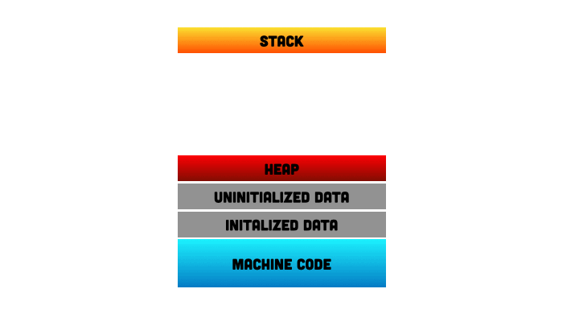

# Control Flow

- It refers to the order in which statements, instructions and operations are executed in a computer program
- It determines the **sequence** in which the instructions are executed and the **conditions** that determine whether or not certain instructions are executed
- Typically controlled by conditional statements (e.g. if/else statements), loops (e.g. for loops, while loops), and function calls
- Allow programmers to **control the flow of their programs and make decisions based on various conditions**
- It is essential in programming because it enables programmers to create complex logic and algorithms that can perform a wide range of tasks

## Go Runtime System
- Manages and schedules the execution of Go programs
- Includes a number of features that make it easy to write concurrent and parallel programs in Go
- It is responsible for managing the execution of Go programs, including memory management, garbage collection, and concurrency

### Goroutine Management
- Lightweight threads that enable concurrent execution of Go programs
- The runtime system manages the creation and destruction of goroutines, and schedules them for execution on available processors

#### Scheduler
- Designed to be efficient and scalable, allowing it to handle thousands of goroutines simultaneously
- It is responsible for distributing goroutines across available threads, managing thread local storage, and coordinating I/O operations
- The scheduler is aware of the underlying hardware, allowing it to take advantage of multi-core processors and other hardware features
- Uses a technique known as **work-stealing** to balance the workload between threads
    - When a thread becomes idle, it steals work from other threads, ensuring that all threads are busy and that work is distributed evenly

### Garbage Collector (GC)
- Designed to be efficient and non-intrusive, minimizing the impact on program performance
- Automatically frees memory that is no longer needed by a program
    - Responsible for identifying and reclaiming unused memory, freeing up resources for other parts of the program
- This makes it easier to write complex programs without worrying about manual memory management
- Uses a technique known as **concurrent mark and sweep** to identify and reclaim unused memory
    - Involves **marking** all live objects in memory and then **sweeping** through memory to reclaim unused memory
- The act of allocating memory on the heap is typically referred as “dynamic memory allocation” because both the compiler and the runtime can make very few assumptions as to how this memory is used and when it can be cleaned up
    - The “heap” can be thought of as a catch-all for memory allocation, for when Go values need to be placed _somewhere_

#### Tracing Garbage Collection
- **Object**
    - An object is dynamically allocated piece of memory that contains one or more Go values
- **Pointer**
    - A memory address that references any value within an object (`*T`)
- Objects and pointers to other objects form the _**object graph**_
- To identify live memory, the GC walks the object graph starting at the program’s roots, pointers that identify objects that are definitely in-use by the program
    - **Scanning** — the process of walking the object graph
    - Two examples of roots: Local and Global Variables
- **Mark-Sweep Technique**
    - In order to keep track of its progress, the GC also **marks** the values it encounters as live
    - Once the tracing is complete, the GC then walks over all memory in the heap and makes all memory that is not marked available for allocation — **sweeping**

#### The GC Cycle
- **Understanding Costs**
    - Consider this model of GC Cost:
        - GC involves only two resources: **Physical Memory** and **CPU Time**
        - GC’s memory costs consists of _live heap memory_, _new heap memory allocated before the mark phase_, and _space for metadata_ that, even if proportional to the previous costs, are small in comparison
            - `GC Memory Cost for Cycle N = Live Heap from Cyle N-1 + New Heap`
        - GC’s CPU costs are modeled as a fixed cost per cycle, and a marginal cost that scales proportionally with the size of the live heap
            - `GC CPU Time for Cycle N = Fixed CPU Time Cost Per Cycle + Average CPU Time Cost Per Byte * Live Heap Memory found in Cycle N`
- **`GOGC`**
    - It works by determining the target heap size after each GC cycle, a target value for the total heap size in the next cycle
        - `Target Heap Memory = Live Heap + (Live Heap + GC Roots) * GOGC/100`
    - Can be configured through either `GOGC` environment variable, or through the `SetGCPercent` API in the `runtime/debug` package (default: `100%`)
    - Doubling `GOGC` will double heap memory overheads and roughly halve GC CPU cost, and vice versa
        - As `GOGC` increases, CPU overhead decreases, but peak memory increases proportionally to the live heap size
            - Less frequent GC, using more memory (RAM) but reducing CPU overhead
        - As `GOGC` decreases, the peak memory requirement decreases at the expense of additional CPU overhead
            - Makes GC run more often, keeping memory (RAM) usage low but increasing CPU work
- **Memory Limit**
    - Sets a maximum on the _total amount of memory that the Go runtime can use_
    - The use of memory limit does not come without a cost, and certainly doesn’t invalidate the utility of `GOGC`
    - Can be configured either via the `GOMEMLIMIT` environment, or through the `SetMemoryLimit` function in the `runtime/debug` package
    - **Suggested Uses**
        - **Do** take advantage of the memory limit when the execution environment of your program is entirely within your control
        - **Do** f’eel free to adjust the memory limit in real-time to adapt to changing conditions
        - **Don’t** set `GOGC` to off with a memory limit if your program might share some of its limited memory with other programs
        - **Don’t** use the memory limit when deploying to an execution environment you don’t control
        - **Don’t** set a memory limit to avoid out-of-memory conditions when a program is already close to its environment’s memory limits

### Memory Management
- The runtime system includes a memory allocator that manages the allocation and deallocation of memory used by a program

#### Memory Allocator
- Designed to be efficient and scalable, making it possible to allocate and deallocate large amounts of memory with ease
- Responsible for the heap — the region of memory used for dynamically allocated objects
- Employs a technique known as bump allocation to quickly allocate memory, and it uses segregated heap to improve allocation and deallocation performance

### Channel Management
- Used in Go to communicate between goroutines
- The runtime system manages the creation and destruction of channels, and ensures that messages are delivered in the correct order

### Stack Management
- Designed to be efficient and scalable, making it possible to handle large numbers of goroutines with ease
- Each goroutine has its own stack, which is used to store local variables and function arguments
- The runtime system manages the allocation and deallocation of stack space for each goroutine
- Employs a technique known as split stacks to manage stack memory, allowing it to allocate and deallocate stack memory on demand

## The Stack & The Heap
- The Go runtime system provides automatic memory management for both the stack and the heap, making it easy to write efficient and scalable concurrent programs
- The stack is located in the high address space and the items are added to the stack moving downwards going from high address to low address space
    - The size of the stack is generally fixed when the application is complied
    - If you run a recursive function in an infinite loop, you will get a stack overflow exception

### Stack
- A region of memory used for **storing variables that are local to a function or a goroutine**
- It is a **LIFO (Last-In-First-Out) data structure**, which means that the most recently added data is the first to be removed
- **Generally faster** than the heap because it is **managed automatically by the Go runtime system**, and memory allocation and deallocation is relatively fast
- Two main responsibilities when your program is running:
    - To keep track of the method that control should return to once execution has finished for the current method
    - To hold the values (or pointers) of local variables used in the methods

#### Stack Data Structure
- Works on the Last In First Out (LIFO) principle
- Can only ever read the data from the item on the top of the stack

#### Stack vs Array vs Queue
- **Array**
    - You can access any item in the array directly using its index (O(1))
- **Queue**
    - Works on the **First In First Out (FIFO)** principle, meaning elements are added at the back (enqueue) and removed from the front (dequeue)
    - You cannot randomly access elements in the middle, you process them in order
- **Stack**
    - Follows the Last In, First Out (LIFO) principle, meaning you only have direct access to the last item added (top of the stack)
    - Functions like a one-ended queue, where insertion and removal happen at the same time

### Heap
- A region of memory used for **storing variables that have a longer lifetime** than those stored on the stack
- A more **flexible data structure** than the stack, but it is **generally slower** because it requires more overhead for memory allocation and deallocation
- The heap is **managed automatically by garbage collector**, which frees up memory that is no longer being used by the program

### Differences in Stack and Heap Memory

|**Feature**|**Stack**|**Heap**|
|---|---|---|
|**Access Speed**|Fast|Slow|
|**Memory Allocation**|Handled automatically by Runtime|Only automatically handled in high level languages|
|**Performance Cost**|Less|More|
|**Size**|Fixed Size|Dynamic Size|
|**Variable Access**|Local variables only|Global variable access|
|**Data Structure**|Linear data structure (stack)|Hierarchical data structure (array/tree)|
|**Main Issue**|Small fixed amount of memory (stack overflow risk)|Memory fragmentation over time|

## Go Compiler
- A program that translates Go source code into machine-readable binary code that can be executed by a computer
- It takes the human-readable code that a programmer writes in Go and converts it into instructions that a computer can understand and execute
- It is responsible for several important tasks, including:
    - **Parsing**
        - The compiler reads the source code and breaks it down into a series of tokens, which are then analyzed for syntax errors
    - **Type Checking**
        - The compiler checks that the types of variables and expressions in the code are consistent and correct according to the rules of the Go Language
    - **Optimization**
        - The compiler performs various optimizations to the code to make it run more efficiently on the target machine
    - **Code generation**
        - The compiler generates machine-readable binary code that can be executed by the target machine

## 🔖 Extras
- [Understanding the Go runtime](https://golab.io/talks/understanding-the-go-runtime)
    - 📽️: [Understanding the Go runtime - Jesus Espino](https://www.youtube.com/watch?v=YpRNFNFaLGY)
- [A Guide to the Go Garbage Collector](https://tip.golang.org/doc/gc-guide)
- [Go Runtime Package - debug.SetGCPercent](https://pkg.go.dev/runtime/debug#SetGCPercent)
- [dotGo 2019 - Bryan Boreham - Go Tune Your Memory](https://www.youtube.com/watch?v=uyifh6F_7WM)
- [Exploring the Power and Flexibility of the Go Runtime](https://medium.com/@jamal.kaksouri/exploring-the-power-and-flexibility-of-the-go-runtime-9a83f33001cf)
- [Stack vs Heap Memory - What are the differences?](https://www.alexhyett.com/stack-vs-heap-memory/)
    - 📽️: [Stack vs Heap Memory - Simple Explanation](https://www.youtube.com/watch?v=5OJRqkYbK-4)